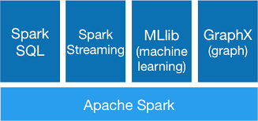

# PySpark-Tutorials
Pyspark is an Apache Spark and Python partnership for Big Data computations. Spark is written in Scala and it provides APIs to work with Scala, JAVA, Python, and R. PySpark is the Python API written in Python to support Spark.

Udemy Course = [Complete PySpark Developer Course](https://www.udemy.com/course/pyspark-developer-course/)

# PySpark
Apache Spark is an open-source, distributed cluster computing framework that is used for fast processing, querying and analyzing Big Data. Spark was developed as highly fault-tolerant, massively parallel, in-memory processing support, easy APIs in multiple language in unified manner.

## What is Spark?
### Unified
Spark is a unified analytics engine mainly desgined for large-scale distributed data processing, on-premises data centers or in the cloud.

### Speed
Spark provides in-memory storage for intermediate computations and limited disk I/O, this gives it a huge performance boost. Run workloads 100x faster.

### Ease of Use (Polyglot)
SupportJava, Python, SQL, R, Scala)

### Generality
Spark powers a stack of libraries including SQL and DataFrames, MLlib for machine learning, Graphx, and Spark Streaming. You can combine these libraries seamlessly in the same application.

### Extensibility
Decouples Compute and Storage. It focuses on fast and parallel computation engine than on storage. Storage can be extended to read data from other souces.

Spark supports many RDBMS.(Hadoop HDFS, Delta lake, Redis, mongoDB, cassandra, PostgreSQL, Apache HBASE, MySQL, elastic search and so on..)

### Runs Everywhere:
01. YARN
02. Kubernetes
03. Mesos
04. EC2(AWS)
05. Standalone

### Open Source

### Scalable

### Distributed

### Powerful Caching

### Real Time and Batch Processing

## Spark Context vs Spark Session

#### Spark APIs - Before Spark 2.0
1. For Core API - SparkContext
2. For Streaming API - StreamingContext
3. For SQL API - SQLContext
Common entry point was created by SparkSession

## What is Hadoop?
Hadoop is a method for distributing large files through a large number of computers. Hadoop frameworks require a lot of read-write operations on a hard disk which makes it very expensive in terms of time and speed.

## Spark vs MapReduce
1. Spark does not need a file server, whereas MapReduce can store files in a HDFS.
2. Spark outperforms MapReduce by up to 100 times when it comes to running operations.
3. Using MapReduce MapReduce writes the remaining data to disc for each Map (here, the input data is processed and stored in an HDFS after which the mapper method produces small chunks of data) and Reduce (here, the input data from the map stage is processed and produced a new set of output for storage in the HDFS) procedure. whereas The majority of the data is loaded into memory after each Spark shift.
4. If the memory in Spark runs out, it will overflow onto the disc.
5. MapReduce writes the majority of the data to disc after each map and reduces operation.
6. Spark retains the bulk of the data in memory after each transformation.

